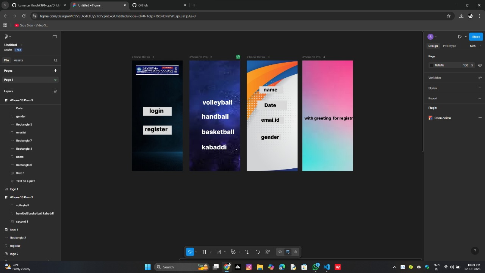

# Ex09 Event Registration Web Application
## Date:17/05/25

## AIM:
To design, develop and deploy a web application for event registration.

## DESIGN STEPS:

### Step 1:
Create a new frame.

### Step 2:
Select any one preset size of your choice.

### Step 3:
Select the shapes you need.

### Step 4:
Import images as needed.

### Step 5:
Create pages based on your need and link them.

### Step 6:

Validate the HTML and CSS code.

### Step 6:

Publish the website in the given URL.

## DESIGN TOOL:
Figma

## CODE:
```
index.html
<!DOCTYPE html>
<html>
  <head>
    <meta name="viewport" content="width=device-width, initial-scale=1" />
    <meta charset="utf-8" />
    <link rel="stylesheet" href="globals.css" />
    <link rel="stylesheet" href="style.css" />
  </head>
  <body>
    <div class="iphone-pro">
      
      
      <div class="div"></div>
      <div class="text-wrapper">login</div>
      <div class="text-wrapper-2">register</div>
      
    </div>
  </body>
</html>

style.css
.iphone-pro {
  background-color: #ffffff;
  width: 100%;
  min-width: 402px;
  min-height: 874px;
  position: relative;
}

.iphone-pro .fourth {
  position: absolute;
  top: 0;
  left: 0;
  width: 402px;
  height: 874px;
  aspect-ratio: 2.22;
  object-fit: cover;
}

.iphone-pro .rectangle {
  top: 368px;
  height: 69px;
  position: absolute;
  left: 88px;
  width: 226px;
}

.iphone-pro .div {
  top: 515px;
  height: 71px;
  background-color: #d9d9d9;
  position: absolute;
  left: 88px;
  width: 226px;
}

.iphone-pro .text-wrapper {
  position: absolute;
  top: 369px;
  left: calc(50.00% - 63px);
  width: 126px;
  font-family: "Inter-ExtraBold", Helvetica;
  font-weight: 800;
  color: #000000;
  font-size: 46px;
  letter-spacing: 0;
  line-height: normal;
}

.iphone-pro .text-wrapper-2 {
  position: absolute;
  top: 515px;
  left: 103px;
  font-family: "Inter-ExtraBold", Helvetica;
  font-weight: 800;
  color: #000000;
  font-size: 46px;
  letter-spacing: 0;
  line-height: normal;
}

.iphone-pro .logo {
  position: absolute;
  top: 39px;
  left: 32px;
  width: 338px;
  height: 77px;
  aspect-ratio: 4.39;
  object-fit: cover;
}
globals.css
@import url("https://cdnjs.cloudflare.com/ajax/libs/meyer-reset/2.0/reset.min.css");
* {
  -webkit-font-smoothing: antialiased;
  box-sizing: border-box;
}
html,
body {
  margin: 0px;
  height: 100%;
}
/* a blue color as a generic focus style */
button:focus-visible {
  outline: 2px solid #4a90e2 !important;
  outline: -webkit-focus-ring-color auto 5px !important;
}
a {
  text-decoration: none;
}

index.html

<!DOCTYPE html>
<html>
  <head>
    <meta name="viewport" content="width=device-width, initial-scale=1" />
    <meta charset="utf-8" />
    <link rel="stylesheet" href="globals.css" />
    <link rel="stylesheet" href="style.css" />
  </head>
  <body>
    <div class="iphone-pro">
      
      <div class="handball-basketball">handball<br /><br />basketball<br /><br />kabaddi</div>
      <div class="volleyball">&nbsp;&nbsp;volleyball</div>
    </div>
  </body>
</html>
 globals.css
 @import url("https://cdnjs.cloudflare.com/ajax/libs/meyer-reset/2.0/reset.min.css");
* {
  -webkit-font-smoothing: antialiased;
  box-sizing: border-box;
}
html,
body {
  margin: 0px;
  height: 100%;
}
/* a blue color as a generic focus style */
button:focus-visible {
  outline: 2px solid #4a90e2 !important;
  outline: -webkit-focus-ring-color auto 5px !important;
}
a {
  text-decoration: none;
}
style.css
.iphone-pro {
  background-color: #ffffff;
  width: 100%;
  min-width: 402px;
  min-height: 874px;
  position: relative;
}

.iphone-pro .second {
  position: absolute;
  top: 0;
  left: 0;
  width: 402px;
  height: 874px;
  aspect-ratio: 1.5;
  object-fit: cover;
}

.iphone-pro .handball-basketball {
  position: absolute;
  top: 411px;
  left: 97px;
  font-family: "Inter-ExtraBold", Helvetica;
  font-weight: 800;
  color: #ffffff;
  font-size: 50px;
  letter-spacing: 0;
  line-height: normal;
}

.iphone-pro .volleyball {
  position: absolute;
  top: 300px;
  left: 82px;
  font-family: "Inter-ExtraBold", Helvetica;
  font-weight: 800;
  color: #ffffff;
  font-size: 50px;
  letter-spacing: 0;
  line-height: normal;
}

index.html
<!DOCTYPE html>
<html>
  <head>
    <meta name="viewport" content="width=device-width, initial-scale=1" />
    <meta charset="utf-8" />
    <link rel="stylesheet" href="globals.css" />
    <link rel="stylesheet" href="style.css" />
  </head>
  <body>
    <div class="iphone-pro">
      
      
      <div class="rectangle"></div>
      <div class="text-wrapper">name</div>
      <div class="div"></div>
      <div class="rectangle-2"></div>
      <div class="text-wrapper-2">emai.id</div>
      <div class="rectangle-3"></div>
      <div class="text-wrapper-3">gender</div>
      <div class="text-wrapper-4">Date</div>
    </div>
  </body>
</html>
globals.css

@import url("https://cdnjs.cloudflare.com/ajax/libs/meyer-reset/2.0/reset.min.css");
* {
  -webkit-font-smoothing: antialiased;
  box-sizing: border-box;
}
html,
body {
  margin: 0px;
  height: 100%;
}
/* a blue color as a generic focus style */
button:focus-visible {
  outline: 2px solid #4a90e2 !important;
  outline: -webkit-focus-ring-color auto 5px !important;
}
a {
  text-decoration: none;
}
style.css
.iphone-pro {
  background-color: #ffffff;
  overflow: hidden;
  width: 100%;
  min-width: 402px;
  min-height: 874px;
  position: relative;
}

.iphone-pro .text-on-a-path {
  position: absolute;
  top: 204px;
  left: -785px;
  width: 189px;
  height: 47px;
}

.iphone-pro .third {
  position: absolute;
  top: 0;
  left: 0;
  width: 402px;
  height: 874px;
  aspect-ratio: 1.6;
  object-fit: cover;
}

.iphone-pro .rectangle {
  top: 204px;
  left: 99px;
  width: 189px;
  height: 57px;
  position: absolute;
  background-color: #d9d9d9;
}

.iphone-pro .text-wrapper {
  position: absolute;
  top: 206px;
  left: calc(50.00% - 69px);
  width: 138px;
  font-family: "Inter-ExtraBold", Helvetica;
  font-weight: 800;
  color: #000000;
  font-size: 40px;
  letter-spacing: 0;
  line-height: normal;
}

.iphone-pro .div {
  top: 316px;
  left: 83px;
  width: 236px;
  height: 74px;
  position: absolute;
  background-color: #d9d9d9;
}

.iphone-pro .rectangle-2 {
  top: 445px;
  left: 113px;
  width: 180px;
  height: 55px;
  position: absolute;
  background-color: #d9d9d9;
}

.iphone-pro .text-wrapper-2 {
  position: absolute;
  top: 445px;
  left: 113px;
  font-family: "Inter-ExtraBold", Helvetica;
  font-weight: 800;
  color: #000000;
  font-size: 40px;
  letter-spacing: 0;
  line-height: normal;
  white-space: nowrap;
}

.iphone-pro .rectangle-3 {
  top: 581px;
  left: 83px;
  width: 189px;
  height: 51px;
  position: absolute;
  background-color: #d9d9d9;
}

.iphone-pro .text-wrapper-3 {
  position: absolute;
  top: 581px;
  left: 113px;
  width: 155px;
  font-family: "Inter-ExtraBold", Helvetica;
  font-weight: 800;
  color: #000000;
  font-size: 40px;
  letter-spacing: 0;
  line-height: normal;
  white-space: nowrap;
}

.iphone-pro .text-wrapper-4 {
  position: absolute;
  top: 329px;
  left: calc(50.00% - 62px);
  font-family: "Inter-ExtraBold", Helvetica;
  font-weight: 800;
  color: #000000;
  font-size: 40px;
  letter-spacing: 0;
  line-height: normal;
  white-space: nowrap;
}

index.html
<!DOCTYPE html>
<html>
  <head>
    <meta name="viewport" content="width=device-width, initial-scale=1" />
    <meta charset="utf-8" />
    <link rel="stylesheet" href="globals.css" />
    <link rel="stylesheet" href="style.css" />
  </head>
  <body>
    <div class="iphone-pro">
      
      <div class="with-greeting-for"><br />with greeting&nbsp;&nbsp;for registration</div>
    </div>
  </body>
</html>
globals.css
@import url("https://cdnjs.cloudflare.com/ajax/libs/meyer-reset/2.0/reset.min.css");
* {
  -webkit-font-smoothing: antialiased;
  box-sizing: border-box;
}
html,
body {
  margin: 0px;
  height: 100%;
}
/* a blue color as a generic focus style */
button:focus-visible {
  outline: 2px solid #4a90e2 !important;
  outline: -webkit-focus-ring-color auto 5px !important;
}
a {
  text-decoration: none;
}
style.css
.iphone-pro {
  background-color: #ffffff;
  overflow: hidden;
  width: 100%;
  min-width: 400px;
  min-height: 874px;
  position: relative;
}

.iphone-pro .fourth {
  position: absolute;
  top: 0;
  left: calc(50.00% - 200px);
  width: 400px;
  height: 874px;
  aspect-ratio: 2;
  object-fit: cover;
}

.iphone-pro .with-greeting-for {
  position: absolute;
  top: 398px;
  left: 16px;
  font-family: "Inter-ExtraBold", Helvetica;
  font-weight: 800;
  color: #000000;
  font-size: 32px;
  letter-spacing: 0;
  line-height: normal;
}

```


##OUTPUT:

 


## RESULT:
The program to design, develop and deploy a web application for event registration is completed successfully.
